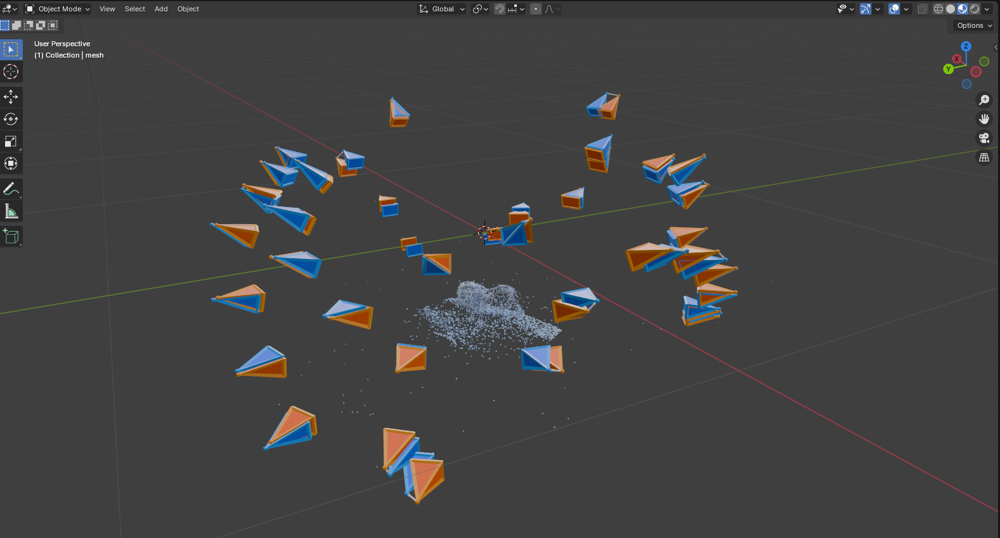

# colmap-notebook

Basic notebook for running colmap and visualizing the output in blender

Install requirements:

```bash
pip install -r requirements.txt
git submodule init
```

(optional) add blender notebook kernel:

```bash
blender_notebook install --blender-exec=/home/linus/workspace/blender/blender-4.0.1-linux-x64/blender --kernel-name blender-colmap
```

Alternatively, use the last cell of the notebook to save a `.blend` file which can be opened separately.

Sample output:



**Blue**: ground truth cameras. **Orange**: estimated cameras.
